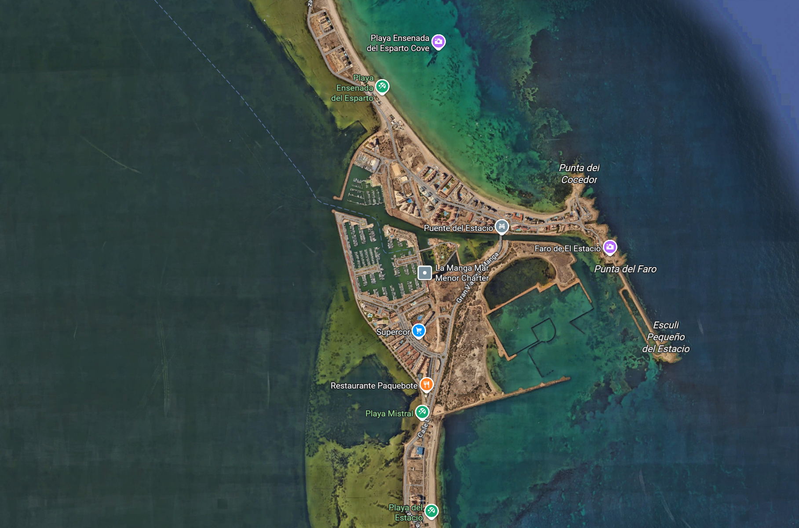

# ThinkInAzul Water Quality Visualization Web 🌊

Welcome to the ThinkInAzul Water Quality Visualization platform. This web application enables you to explore, visualize, and download water quality data collected from two key locations in the Mar Menor region: Estacio and Marchamalo.

	<a href="https://farcasucam.github.io/ThinkAzul/" style="font-size:1em; font-weight:bold; color:#1976d2; background:#F4E8C8; border-radius:8px; padding:12px 24px; display:inline-block; text-decoration:none; border:2px solid #1976d2; margin-bottom:24px;">🔗 Web App</a>

## About the Project 🏛️

This project is part of the ThinkInAzul initiative ([thinkinazul.es](https://thinkinazul.es/)), funded by:
![Patreons]patreons.png)

The project brings together several research groups in ([UCAM]https://www.ucam.edu/):

- 📡 [GRITA: Grupo de Investigación en Telecomunicaciones Avanzadas](https://investigacion.ucam.edu/grupos/grupo/telecomunicaciones-iot-smartcity-sonido-acustica)
- 🏃‍♂️ [UKEIM: Universal Knowledge Enhancement by Multidisciplinary Implementation](https://investigacion.ucam.edu/grupos/grupo/ukeim)
- 🌱 [Tecnologías Aplicadas a la Salud Ambiental](https://investigacion.ucam.edu/grupos/grupo/tecnologias-aplicadas-a-la-salud-ambiental)

## Dataset Overview 📊
The dataset ([`Parametros_Aguas.csv`](Parametros_Aguas.csv)) contains water quality measurements taken periodically at two locations:

- 📍 **Estacio** 
- 📍 **Marchamalo** 

### Time Period 🗓️

Measurements span from **March 2023 to April 2024**, providing a comprehensive view of seasonal and environmental changes.

### Parameters Measured 🧪

Each row in the CSV file represents a measurement at a specific date and place. The main parameters include:

- 📅 **Date**: Measurement date
- 📌 **Place**: Location of measurement (Estacio or Marchamalo)
- 🧪 **pH General**: Acidity/alkalinity of water
- ⚡ **CE compensada (mS/mL)**: Compensated electrical conductivity
- 🫧 **O2 (mg/L)**: Dissolved oxygen
- 🧂 **Salinidad (ppt)**: Salinity
- 🌫️ **Turbidez (mg/L)**: Turbidity
- 🌡️ **Temperatura (C)**: Water temperature
- 🧬 **Ca, Cb, Cc, Al, As, Be, Bi, B, Cd, Co, Cr, Cu, Fe, K, La, Li, Mg, Mn, Mo, Na, Ni, Pb, P, Rb, Sb, Se, Si, S, Sr, Ti, Tl, V, Zn, F-, Cl-, NO2-, Br-, NO3-, PO43-, SO42-**: Various chemical and mineral concentrations (see CSV header for full list)

Values are separated by semicolons (`;`) and use commas (`,`) as decimal points.

## How to Use the Web Application 🖥️

1. **Explore the Timeline** 🗓️: Select a date range to view measurements over time.
2. **Choose Locations** 📍: Select one or both places to compare water quality data.
3. **Select Parameters** 🧪: Pick which water quality parameter to visualize in the interactive charts.
4. **View Interactive Charts** 📈: Line and histogram charts update based on your selections.
5. **Download Data** ⬇️: Click the download link below the charts to get the raw CSV data for your own analysis.

## Acknowledgements 🙏
- Financiado por Ia Unión Europea: NextGenerationEU
- Ministerio de Ciencia, Innovación y Universidades
- Plan de Recuperación, Transformación y Resiliencia
- Región de Muurcia
- Fundación Séneca
- UCAM

For more information, visit [thinkinazul.es](https://thinkinazul.es/).

